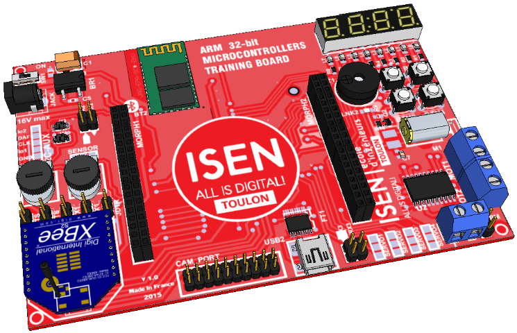
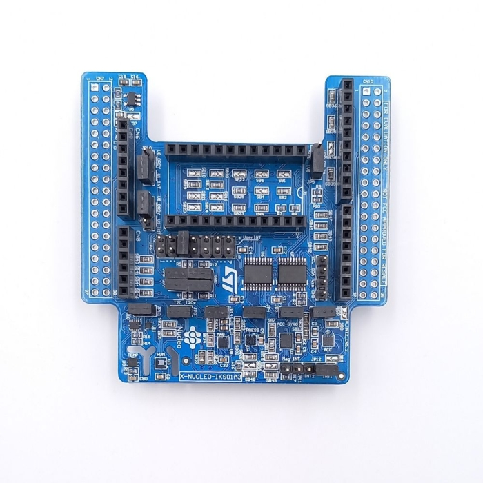
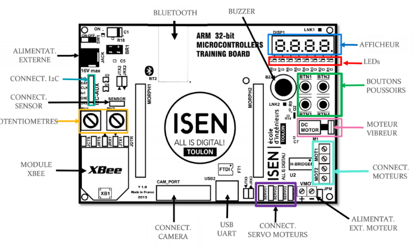

# Projet Microprocesseur - Second Semestre - 6 ISEN

## PodoMétéo

Pour le projet de microprocesseur de second semestre, nous avons développé **PodoMétéo**.

  

Nous avions à disposition **la carte Isen32**, une carte de développement pour microcontrôleurs ARM 32 bits. Cette carte est dédiée à l'apprentissage et à la réalisation d'applications utilisant la famille de modules embarqués **STM32 Nucleo** de ST Microelectronics.

  

En plus de cela, nous avions aussi le **shield IKS01A3**, un module s'implémentant sur notre carte **STM Nucleo L152-RE**. Il permet d'avoir plusieurs fonctionnalités et capteurs, que nous détaillerons plus tard.

### Description

**PodoMétéo** est conçu pour optimiser la performance et le bien-être global des athlètes. Cet outil est indispensable pour les sportifs de tous niveaux, offrant les fonctionnalités suivantes :

- **Suivi Avancé de l'Activité Physique** : Suivi du nombre de pas effectués.
- **Surveillance des Conditions Environnementales** : Mesure de la température et de l'humidité ambiante.

### Fonctionnalités

**PodoMétéo** intègre deux fonctionnalités principales :

1. **Podomètre** :
   - Compte le nombre de pas effectués.

2. **Surveillance Environnementale** :
   - Mesure la température et l'humidité pour identifier les facteurs environnementaux pouvant influencer la performance des athlètes.

Nous espérons que **PodoMétéo** sera un atout précieux pour améliorer la performance et le bien-être des athlètes.

### Explication du Fonctionnement

Nous disposons des composants suivants pour réaliser ce projet :

- **Carte Isen32** : Plateforme de développement basée sur les microcontrôleurs ARM 32 bits.
- **Shield IKS01A3** : Module de capteurs ajoutant des fonctionnalités de mesure environnementale et d'activité physique.
  - **Capteur LIS2DW12** : Accéléromètre 3 axes MEMS (capacitifs) pour le suivi des pas.
  - **Capteur HTS221** : Capteur d'humidité et de température pour la surveillance des conditions ambiantes.

  

### Interface Utilisateur

L'utilisateur pourra effectuer les actions suivantes sur la carte :
- **Bouton 2 (BTN_2) :** Affiche le nombre de pas.

  

(ImagesSTM32/nombre_de_pas.jpg)
- **Bouton 3 (BTN_3):** Affiche l'humidité.

  

- **Bouton 4 (BTN_4):** Affiche la température.

  

- **Potentiomètre :** Permet de régler la luminosité de l'afficheur.

  

---

Nous espérons que **PodoMétéo** sera un outil précieux pour améliorer la performance et le bien-être des athlètes.
